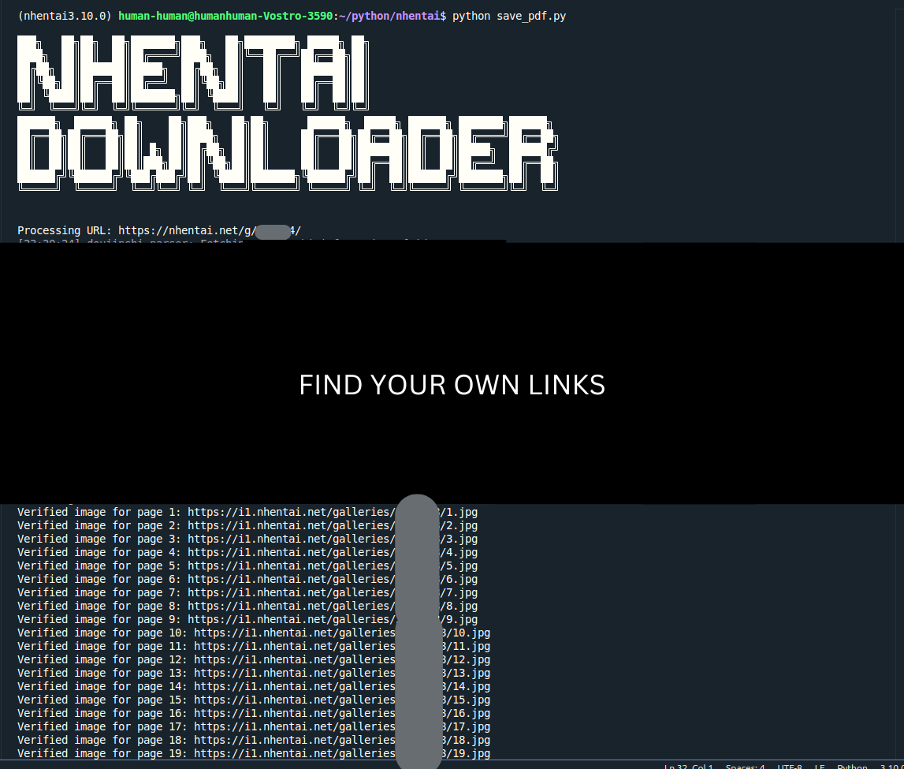

# NHentai Manga Downloader
#### installation and usage youtube link: https://youtu.be/EounyXG_Ej8?si=2nFGnHt9DThVv5I2
#### Description:

This project is a Python-based command-line tool that allows users to download manga from NHentai. It features robust error handling, asynchronous downloads for better performance, automatic PDF conversion, and a clean, modular design that makes the code maintainable and testable.



## Project Structure

The project consists of several key files:

### save_pdf.py
This file handles downloading manga at high-resolution(up to 1080*2050p) and automatically converting them to PDF format. Each manga is saved in a folder named `mangaID_mangaNAME` and converted to a PDF of the same name.

### simple.py  
This file provides a lightweight implementation for downloading mangas at 400*565p resolution, suitable for users who prefer smaller file sizes.

### project.py
This file offers high-resolution manga downloads (up to 1080*2050p) with advanced error handling and retry mechanisms.it saves the manga in a folder named `mangaID_mangaNAME` and keep them in image formats(jpg,png,webp,gif).

### Configuration
- Add manga URLs to `constants.txt`, one per line
- Supported URL formats:
  ```
  https://nhentai.net/g/123456/
  https://nhentai.net/g/123456
  123456
  ```

## Installation and Usage

### Windows Installation
1. Install Python 3.10.0:
   - Download Python 3.10.0 installer from [Python Official Website](https://www.python.org/downloads/release/python-3100/)
   - Run the installer (python-3.10.0-amd64.exe)
   - Check "Add Python 3.10 to PATH"
   - Choose "Customize installation"
   - Check all Optional Features
   - Check all Advanced Options
   - Click Install

2. Create and activate virtual environment:
```cmd
# Open Command Prompt as Administrator
cd %USERPROFILE%\Documents
python -m venv venv_nhentai_Py3.10.0

# Activate virtual environment
venv_nhentai_Py3.10.0\Scripts\activate
```

3. Install dependencies:
```cmd
pip install -r requirements.txt
```

### Linux Installation
1. Install Python 3.10.0:
```bash
# Install dependencies for building Python
sudo apt-get update
sudo apt-get install -y make build-essential libssl-dev zlib1g-dev \
libbz2-dev libreadline-dev libsqlite3-dev wget curl llvm \
libncurses5-dev libncursesw5-dev xz-utils tk-dev libffi-dev \
liblzma-dev python-openssl

# Install pyenv
curl https://pyenv.run | bash

# Add to ~/.bashrc
echo 'export PYENV_ROOT="$HOME/.pyenv"' >> ~/.bashrc
echo 'command -v pyenv >/dev/null || export PATH="$PYENV_ROOT/bin:$PATH"' >> ~/.bashrc
echo 'eval "$(pyenv init -)"' >> ~/.bashrc

# Reload shell
source ~/.bashrc

# Install Python 3.10.0
pyenv install 3.10.0
cd folder_you_want_to_install_to
pyenv local 3.10.0
```

2. Create and activate virtual environment:
```bash
# Create virtual environment
python -m venv venv_nhentai_Py3.10.0

# Activate virtual environment
source venv_nhentai_Py3.10.0/bin/activate
```

3. Install dependencies:
```bash
pip install -r requirements.txt
```

### macOS Installation
1. Install Homebrew (if not already installed):
```bash
/bin/bash -c "$(curl -fsSL https://raw.githubusercontent.com/Homebrew/install/HEAD/install.sh)"
```

2. Install pyenv using Homebrew:
```bash
brew update
brew install pyenv

# Add pyenv to shell
echo 'export PYENV_ROOT="$HOME/.pyenv"' >> ~/.zshrc
echo 'command -v pyenv >/dev/null || export PATH="$PYENV_ROOT/bin:$PATH"' >> ~/.zshrc
echo 'eval "$(pyenv init -)"' >> ~/.zshrc

# Reload shell configuration
source ~/.zshrc
```

3. Install Python 3.10.0 using pyenv:
```bash
# Install Python 3.10.0
pyenv install 3.10.0

# Navigate to your project directory
cd your_project_directory

# Set local Python version
pyenv local 3.10.0
```

4. Create and activate virtual environment:
```bash
# Create virtual environment
python -m venv venv_nhentai_Py3.10.0

# Activate virtual environment
source venv_nhentai_Py3.10.0/bin/activate
```

5. Install dependencies:
```bash
pip install -r requirements.txt
```

### Usage Options

1. For high-quality downloads with PDF conversion:
```bash
# Linux
python save_pdf.py

# Windows
python save_pdf.py

# macOS
python save_pdf.py
```

2. For high-resolution downloads (images only):
```bash
# Linux
python project.py

# Windows
python project.py

# macOS
python project.py
```

3. For faster, lower-resolution downloads:
```bash
# Linux
python simple.py

# Windows
python simple.py

# macOS
python simple.py
```

### Output Structure
- Downloads are saved in folders named `mangaID_mangaNAME`
- When using save_pdf.py:
  - Images are saved in the manga folder
  - A PDF is automatically created with the same name
- Failed downloads are logged in store.txt


## Detailed Implementation

### save_pdf.py
The most feature-complete implementation that combines downloading and PDF conversion:

- `extract_manga_id(url)`: Extracts manga IDs from various URL formats using robust regex patterns
- `safe_format_filename(name)`: Creates safe filenames by removing illegal characters
- `fetch_manga_images(manga_id)`: Asynchronously retrieves image URLs from multiple servers
- `download_images(manga_id, image_urls, download_folder)`: Downloads images with progress tracking
- `download_manga(url)`: Orchestrates the download process and creates properly named folders
- `convert_to_pdf(manga_folder)`: Converts downloaded images to a single PDF file
- `main()`: Processes URLs from constants.txt and handles the entire workflow

Key features:
- Automatic folder naming in `mangaID_mangaNAME` format
- PDF conversion after successful downloads
- Comprehensive error handling and logging
- Support for multiple image servers and formats

### project.py
The high-resolution downloader implementation:

- Focuses on obtaining the highest quality images available
- Uses multiple server fallbacks for reliability
- Implements sophisticated retry logic
- Provides detailed progress reporting
- Handles various URL formats and edge cases

Implementation details:
- Uses asynchronous HTTP requests for better performance
- Implements smart server selection
- Handles network timeouts and retries
- Provides comprehensive error reporting

### simple.py
A streamlined implementation focusing on efficiency:

- Uses BeautifulSoup for HTML parsing
- Downloads lower resolution images for faster processing
- Simplified error handling
- More memory-efficient implementation
- Ideal for bulk downloads where maximum quality isn't required

### test_project.py
Comprehensive test suite ensuring code reliability:

- Unit tests for URL parsing and validation
- Tests for filename sanitization
- Error handling verification
- Network request mocking
- Edge case coverage

Test categories:
1. URL Processing Tests
   - Valid URL formats
   - Invalid URL handling
   - Edge cases
2. Filename Processing Tests
   - Character sanitization
   - Length limitations
   - Special character handling
3. Download Process Tests
   - Network error handling
   - Invalid manga IDs
   - Server response handling

### requirements.txt
Project dependencies with specific versions:

- Python 3.10.0 (recommended)
- httpx: Async HTTP client
- nhentai: Parser for manga information
- beautifulsoup4: HTML parsing
- img2pdf: PDF conversion
- pytest: Testing framework
- Other supporting libraries

## Design Choices

1. **Asynchronous Architecture**
   - Uses async/await for improved performance
   - Implements concurrent downloads
   - Maintains code readability
   - Efficient resource utilization

2. **Modular Design**
   - Single responsibility principle
   - Easy testing and maintenance
   - Clear separation of concerns
   - Simplified debugging

3. **Error Handling Strategy**
   - Multi-level error catching
   - Graceful failure handling
   - Detailed error reporting
   - Recovery mechanisms

4. **File Management**
   - Structured folder naming
   - Automatic PDF conversion
   - Safe file operations
   - Cross-platform compatibility


### File Permissions
Linux:
```bash
# If you encounter permission issues
chmod +x save_pdf.py project.py simple.py
```

Windows:
- Right-click the Python files
- Properties → Security → Edit → Allow full control for your user

## Testing

Run the test suite:
```bash
# Run all tests
pytest test_project.py -v

# Run specific test categories
pytest test_project.py -v -k "test_extract_manga_id"
pytest test_project.py -v -k "test_safe_format_filename"
```

## Troubleshooting

1. Download Issues:
- Check your internet connection
- Verify the manga ID exists
- Ensure you have write permissions in the directory

2. PDF Conversion Issues:
- Verify img2pdf is properly installed
- Check if all images were downloaded successfully
- Ensure sufficient disk space

3. Permission Issues:
- Run with appropriate permissions
- Check folder access rights
- Verify file ownership

## Future Improvements

Planned enhancements:
- Graphical user interface
- Download progress visualization
- Batch download management
- Download resume capability
- Custom PDF formatting options
- Parallel processing for multiple mangas

## License

This project is licensed under the GNU General Public License v3.0 - see the [LICENSE](LICENSE) file for details.

The GPL-3.0 license ensures that:
- You can freely use, modify, and distribute this software
- Any modifications or derivative works must also be open source under GPL-3.0
- The software comes with no warranty
- You must include the original copyright notice and license

For more information about your rights and obligations under this license, please refer to the full license text in the LICENSE file or visit <https://www.gnu.org/licenses/gpl-3.0.html>.
